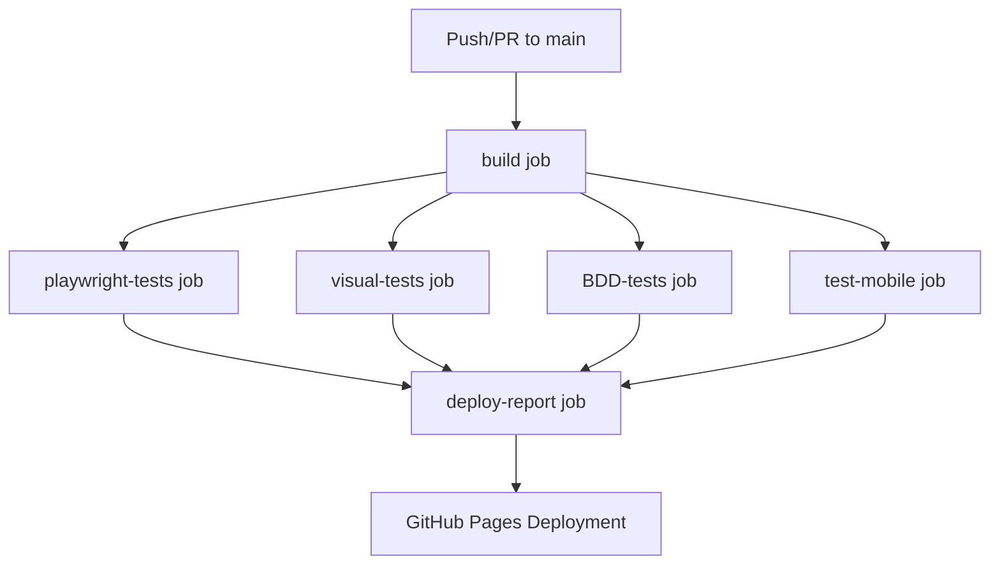

# 🚀 Playwright CI/CD Pipeline Guide

## Overview
This guide explains your existing GitHub Actions pipeline configuration in `.github/workflows/playwright.yml` for automated Playwright testing.

## 📋 Pipeline Structure

Your pipeline consists of **6 main jobs** that run in sequence and parallel:



### **Pipeline Jobs Overview:**
1. **`build`** - Dependency installation and caching
2. **`playwright-tests`** - Standard Playwright test execution
3. **`visual-tests`** - Visual regression and screenshot testing
4. **`BDD-tests`** - Cucumber BDD test execution with TypeScript
5. **`test-mobile`** - Mobile device testing
6. **`deploy-report`** - Consolidates and publishes all test reports

---

## 🔧 Job 1: `build` - Dependency Setup & Caching

### **Purpose:**
Centralized dependency installation and caching for all subsequent jobs.

### **Environment:**
- **OS**: `ubuntu-latest`
- **Node.js**: Version 20
- **Cache**: npm dependencies cached for subsequent jobs

### **Steps:**
```yaml
- name: Checkout
  uses: actions/checkout@v4

- name: Setup Node.js
  uses: actions/setup-node@v4
  with:
    node-version: '20'
    cache: npm

- name: Install deps
  run: npm ci
```

**Benefits:**
- **Faster subsequent jobs**: Dependencies cached and shared
- **Consistency**: All jobs use same dependency versions
- **Fail-fast**: Dependency issues caught early

---

## 🧪 Job 2: `playwright-tests` - Standard Test Execution

### **Dependencies:**
```yaml
needs: build
```

### **Matrix Strategy:**
```yaml
strategy:
  fail-fast: false
  matrix:
    browser: [chromium]
```

### **Trigger Events:**
```yaml
on:
  push:
    branches: [ main, master ]
  pull_request:
    branches: [ main, master ]
```
- Runs on pushes to `main` or `master` branches
- Runs on pull requests targeting these branches

### **Concurrency Control:**
```yaml
concurrency:
  group: ci-${{ github.ref }}
  cancel-in-progress: true
```
- Cancels previous runs if new commit is pushed
- Prevents resource waste from concurrent runs

### **Matrix Strategy:**
```yaml
strategy:
  fail-fast: false
  matrix:
    browser: [chromium]
    # Commented out: [chromium, firefox, webkit]
```
- **Currently**: Only tests `chromium`
- **Potential**: Can test multiple browsers (firefox, webkit)
- `fail-fast: false` ensures all browsers run even if one fails

### **Environment:**
- **OS**: `ubuntu-latest`
- **Node.js**: Version 20
- **Timeout**: 60 minutes
- **Cache**: npm dependencies cached automatically

### **Steps Breakdown:**

#### Standard Tests Execution
```yaml
- name: Run Playwright tests
  run: npx playwright test --project=${{ matrix.browser }} --ignore="test/example.spec.ts" --ignore="test/pom-demo.spec.ts" --ignore="test/pom-learning-examples.spec.ts"
  env:
    CI: true
```
- Runs all standard Playwright tests (functional, API, forms, accessibility)
- **Excludes demo/learning files** to focus on real tests
- Includes API testing, form interactions, POM working demos
- `CI: true` enables CI-specific configurations

---

## 🎨 Job 3: `visual-tests` - Visual Regression Testing

### **Dependencies:**
```yaml
needs: build
```

### **Purpose:**
Comprehensive visual regression testing with cross-platform snapshot generation.

### **Key Steps:**

#### Linux Snapshot Generation (First)
```yaml
- name: Update Visual Test Snapshots (Linux)
  run: npx playwright test visual-testing-comprehensive.spec.ts --project=${{ matrix.browser }} --update-snapshots
  env:
    CI: true
```
- **Critical**: Generates Linux-specific snapshots for CI environment
- Fixes cross-platform visual testing issues (Windows vs Linux rendering)

#### Visual Tests Execution
```yaml
- name: Run Visual Tests
  run: npx playwright test visual-testing-comprehensive.spec.ts --project=${{ matrix.browser }} --grep-invert="@api" --grep-invert="@db"
  env:
    CI: true
```

**Features Tested:**
- ✅ **Responsive Design**: Multiple viewport sizes (375px to 2560px)
- ✅ **Cross-browser Consistency**: Screenshot comparisons
- ✅ **Theme Testing**: Light/dark theme visual validation
- ✅ **Component Testing**: Individual UI component screenshots
- ✅ **Full Page Screenshots**: Complete page visual regression

---

## 🥒 Job 4: `BDD-tests` - Cucumber BDD Execution

### **Dependencies:**
```yaml
needs: build
```

### **Purpose:**
Behavior-Driven Development tests using Cucumber with TypeScript support.

### **Key Features:**

#### Comprehensive Diagnostics
```yaml
- name: Run BDD Tests (Cucumber)
  run: |
    echo "== Listing repo files =="
    ls -R .
    echo
    echo "== Playwright config (if present) =="
    npx playwright show-config || true
    echo
    echo "== Cucumber version =="
    npx cucumber-js --version || true
    echo
    echo "== Available test files (Playwright discover) =="
    npx playwright test --list --project=${{ matrix.browser }} || true
    echo
    echo "== Running Cucumber BDD tests =="
    npm run test:bdd
  env:
    CI: true
```

#### BDD Test Execution
```bash
npm run test:bdd
# Executes: cucumber-js features/*.feature --require-module ts-node/register --require features/step-definitions/**/*.ts
```

**BDD Framework Stack:**
- ✅ **Cucumber**: `@cucumber/cucumber ^12.2.0`
- ✅ **TypeScript Support**: `ts-node ^10.9.2` with auto-registration
- ✅ **Playwright Integration**: Custom BaseClass bridging Cucumber + Playwright
- ✅ **Step Definitions**: TypeScript-based step definitions in `features/step-definitions/`

**BDD Test Coverage:**
- 🥒 **Navigation Testing**: Homepage navigation flows
- 🥒 **Search Functionality**: Content search and validation
- 🥒 **Responsive Behavior**: Mobile and tablet device testing
- 🥒 **User Interactions**: Click, form filling, page transitions

#### BDD Reports Generation
```yaml
--format html:test-results/cucumber-report.html
--format json:test-results/cucumber-report.json
```
- **HTML Report**: Human-readable test results with screenshots
- **JSON Report**: Machine-readable data for CI/CD integration
- **Screenshots & Videos**: Automatic capture on test execution

---

## 📱 Job 5: `test-mobile` - Mobile Device Testing

### **Dependencies:**
```yaml
needs: build
```

### **Purpose:**
Tests your application on mobile devices (Chrome and Safari mobile).

---

## 📊 Job 6: `deploy-report` - Report Consolidation & Deployment

### **Dependency:**
```yaml
needs: [playwright-tests, visual-tests, BDD-tests, test-mobile]
if: always()
```
- Waits for **all test jobs** to complete
- Runs even if tests fail (`if: always()`)
- Consolidates reports from all testing jobs

### **Steps:**

#### Download All Artifacts
```yaml
- name: Download all artifacts
  uses: actions/download-artifact@v4
```
Downloads all test reports from both jobs.

#### Deploy to GitHub Pages
```yaml
- name: Deploy to GitHub Pages
  uses: peaceiris/actions-gh-pages@v3
  if: github.ref == 'refs/heads/main'
  with:
    github_token: ${{ secrets.GITHUB_TOKEN }}
    publish_dir: ./playwright-report
```
- Only deploys from `main` branch
- Publishes HTML reports to GitHub Pages
- Uses built-in `GITHUB_TOKEN` (no setup required)

---

## 🎯 Current Configuration Analysis

### **✅ Strengths:**
1. **Comprehensive Test Coverage**: 
   - Standard Playwright tests (functional, API, forms)
   - Visual regression testing with cross-platform snapshots
   - BDD tests with Cucumber and TypeScript
   - Mobile device testing
   - Accessibility testing
2. **Advanced CI/CD Architecture**: 
   - Dependency caching with build job
   - Parallel test execution for faster results
   - Cross-platform visual testing (Windows local + Linux CI)
3. **BDD Integration**: 
   - TypeScript-powered Cucumber tests
   - Custom Playwright-Cucumber bridge via BaseClass
   - Comprehensive diagnostics and debugging
4. **Robust Reporting**: 
   - HTML + JSON reports for all test types
   - Screenshot and video capture
   - Artifact preservation for debugging
   - Automatic GitHub Pages deployment
5. **Production-Ready Features**: 
   - Proper error handling and retry logic
   - Concurrency control to prevent resource conflicts
   - Fail-safe execution (continues even if some tests fail)
   - 30-day artifact retention

### **🔧 Recent Improvements Made:**
1. **✅ Fixed Dependency Conflicts**: Removed conflicting `@cucumber/playwright` package
2. **✅ Cross-Platform Visual Testing**: Added Linux snapshot generation for CI
3. **✅ BDD CI Integration**: Fixed Cucumber execution with TypeScript support
4. **✅ Enhanced Diagnostics**: Added comprehensive logging for troubleshooting
5. **✅ Optimized Test Execution**: Excluded demo files from CI runs

### **🔧 Potential Improvements:**

#### 1. **Expand Browser Coverage:**
```yaml
# Current
matrix:
  browser: [chromium]

# Recommended
matrix:
  browser: [chromium, firefox, webkit]
```

#### 2. **Add Test Sharding (for large test suites):**
```yaml
strategy:
  matrix:
    shard: [1, 2, 3, 4]
steps:
  - name: Run Playwright tests
    run: npx playwright test --shard=${{ matrix.shard }}/${{ strategy.job-total }}
```

#### 3. **Add Test Summary:**
```yaml
- name: Publish Test Summary
  uses: dorny/test-reporter@v1
  if: always()
  with:
    name: Playwright Tests
    path: test-results/*.xml
    reporter: java-junit
```

---

## 🥒 BDD Testing Deep Dive

### **Framework Architecture:**
```
├── features/                           # Gherkin feature files
│   ├── navigation.feature             # Navigation scenarios
│   ├── search.feature                 # Search functionality
│   └── responsive.feature             # Responsive design tests
├── features/step-definitions/         # TypeScript step definitions
│   ├── baseClass.ts                   # Cucumber-Playwright bridge
│   ├── hooks.ts                       # Setup/teardown logic
│   ├── navigation.steps.ts            # Navigation step implementations
│   ├── search.steps.ts                # Search step implementations
│   └── responsive.steps.ts            # Responsive step implementations
└── test-results/                      # Generated reports
    ├── cucumber-report.html           # Human-readable report
    ├── cucumber-report.json           # CI integration data
    ├── screenshots/                   # Test screenshots
    └── videos/                        # Test execution videos
```

### **BDD Test Execution Flow:**
1. **Gherkin Parsing**: Cucumber reads `.feature` files
2. **TypeScript Compilation**: `ts-node` compiles step definitions on-the-fly
3. **Playwright Integration**: Custom `BaseClass` bridges Cucumber with Playwright
4. **Test Execution**: Each scenario runs in isolated browser context
5. **Reporting**: HTML/JSON reports generated with screenshots/videos

### **Example BDD Scenario:**
```gherkin
Feature: Website Navigation
  As a user
  I want to navigate through the website
  So that I can access different sections

  Scenario: User visits the homepage
    Given User has internet access
    When User navigates to the Playwright homepage
    Then Homepage should load successfully
    And Main navigation should be visible
    And Page title should contain "Playwright"
```

### **Local BDD Commands:**
```bash
# Run all BDD tests
npm run test:bdd

# Run specific feature
npm run test:bdd-navigation

# Run with specific reporting
npm run test:bdd-html    # HTML report only
npm run test:bdd-json    # JSON report only

# View reports
npm run report:bdd       # Opens HTML report
```

---

## 🚀 How to Use This Pipeline

### **1. Automatic Triggers:**
- **Push to `main`** → Full pipeline runs (all 6 jobs)
- **Create PR** → Full pipeline runs for validation
- **Manual Trigger** → Can be triggered from GitHub Actions tab

### **2. Pipeline Execution Order:**
```
1. build (first)              ← Installs dependencies
2. playwright-tests           ← Standard tests
   visual-tests               ← Visual regression  
   BDD-tests                  ← Cucumber BDD
   test-mobile                ← Mobile testing
   (2-5 run in parallel)
3. deploy-report (last)       ← Consolidates all reports
```

### **3. Viewing Results:**
- **GitHub Actions Tab**: Live pipeline status and logs
- **Artifacts Section**: Download detailed reports (available for 30 days)
- **GitHub Pages**: Published HTML reports (https://your-username.github.io/repo-name)
- **PR Comments**: Test results summary (if configured)

### **4. Debugging Failed Tests:**

#### Standard Tests
1. Check GitHub Actions logs for error details
2. Download `playwright-report-chromium` artifact
3. Review screenshots in `test-results/` folder
4. Check trace files for step-by-step execution

#### Visual Tests
1. Download `visual-report-chromium` artifact
2. Compare expected vs actual screenshots
3. Review visual diff highlights
4. Check if snapshots need updating

#### BDD Tests
1. Download `bdd-report-chromium` artifact
2. Open `cucumber-report.html` for detailed scenario results
3. Review step-by-step execution with screenshots
4. Check `videos/` folder for test recordings

#### Mobile Tests
1. Download `playwright-mobile-report` artifact
2. Review mobile-specific test results
3. Check responsive design screenshots

### **5. Local Testing Before Push:**
```bash
# Quick validation
npm test                    # Standard Playwright tests
npm run test:bdd           # BDD tests only
npm run test:visual        # Visual tests (uses local snapshots)
npm run test:mobile        # Mobile tests

# Full pipeline simulation
npm ci                     # Clean dependency install
npm run test              # All standard tests
npm run test:visual       # Visual regression
npm run test:bdd          # BDD scenarios
npm run test:mobile       # Mobile testing

# Generate reports locally
npm run report            # Playwright HTML report
npm run report:bdd        # Cucumber HTML report
```

### **6. Updating Visual Baselines:**
```bash
# Local (Windows snapshots)
npm run test:visual-update

# CI will auto-generate Linux snapshots
# Both platforms supported simultaneously
```
---

## 🔧 Troubleshooting Guide

### **Common BDD Issues:**

#### ❌ "cucumber-js: command not found"
```bash
# Solution: Ensure @cucumber/cucumber is installed
npm ci
npx cucumber-js --version  # Should show version 12.2.0
```

#### ❌ "Cannot find module 'ts-node'"
```bash
# Solution: TypeScript support missing
npm install --save-dev ts-node typescript
```

#### ❌ "Step definition not found"
```bash
# Check feature files point to correct step definitions
cucumber-js features/*.feature --require-module ts-node/register --require features/step-definitions/**/*.ts --dry-run
```

#### ❌ Visual tests failing on Linux vs Windows
```yaml
# Solution: Pipeline auto-generates Linux snapshots
# Local: Use Windows snapshots (automatically detected)
# CI: Uses Linux snapshots (automatically generated)
```

### **Performance Optimization:**

#### Pipeline Speed
- **Dependencies cached** by build job
- **Parallel execution** of test jobs
- **Single browser** matrix for faster runs
- **Artifact reuse** across jobs

#### Visual Testing
- **Platform-specific snapshots** eliminate false positives
- **Threshold settings** handle minor rendering differences
- **Selective testing** with `--grep-invert` excludes API/DB tests

---

## 📚 Configuration Files Integration

### **Key Dependencies (package.json):**
```json
{
  "devDependencies": {
    "@cucumber/cucumber": "^12.2.0",       // BDD framework
    "@playwright/test": "^1.55.1",         // Testing framework
    "ts-node": "^10.9.2",                  // TypeScript execution
    "typescript": "^5.2.0"                 // TypeScript compiler
  }
}
```

### **Pipeline Configuration (.github/workflows/playwright.yml):**
- **6 Jobs**: build → (playwright-tests, visual-tests, BDD-tests, test-mobile) → deploy-report
- **Node.js 20**: Consistent across all jobs
- **Ubuntu Latest**: Linux environment for consistent CI
- **30-day artifacts**: Extended retention for debugging

---

## 🎉 Summary

Your **unified pipeline** provides comprehensive testing coverage with:

### **🧪 Test Types:**
1. **Functional Testing** → Standard Playwright tests (forms, API, navigation)
2. **Visual Regression** → Cross-platform screenshot comparisons  
3. **BDD Testing** → Cucumber scenarios with TypeScript
4. **Mobile Testing** → Device simulation and responsive validation
5. **Accessibility Testing** → A11y validation included

### **🚀 Advanced Features:**
- ✅ **Cross-Platform Visual Testing** → Windows local + Linux CI snapshots
- ✅ **TypeScript BDD Integration** → Cucumber + ts-node + Playwright bridge
- ✅ **Comprehensive Diagnostics** → Detailed logging and error reporting
- ✅ **Parallel Execution** → Optimized job dependencies for speed
- ✅ **Artifact Management** → 30-day retention with detailed reports
- ✅ **GitHub Pages Deployment** → Automatic HTML report publishing

### **🔧 Recent Improvements:**
1. **Fixed Dependency Conflicts** → Removed `@cucumber/playwright` 
2. **Enhanced BDD CI** → Added TypeScript support and diagnostics
3. **Cross-Platform Visuals** → Linux snapshot generation for CI
4. **Optimized Test Selection** → Excluded demo files from CI runs

### **📈 Production Ready:**
Your pipeline is now **enterprise-grade** with robust error handling, comprehensive test coverage, and advanced CI/CD features. Perfect for professional TypeScript + Playwright + BDD development! 🎯