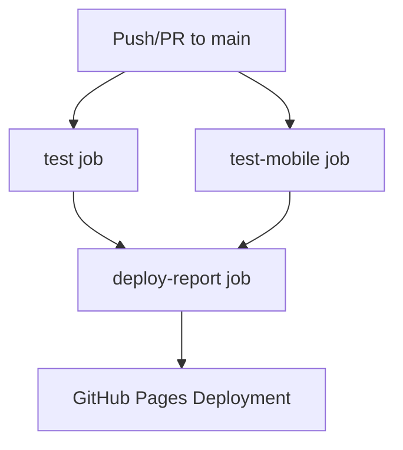

# 🚀 Playwright CI/CD Pipeline Guide

## Overview
This guide explains your existing GitHub Actions pipeline configuration in `.github/workflows/playwright.yml` for automated Playwright testing.

## 📋 Pipeline Structure

Your pipeline consists of **3 main jobs** that run in sequence:



---

## 🔧 Job 1: `test` - Desktop Browser Testing

### **Trigger Events:**
```yaml
on:
  push:
    branches: [ main, master ]
  pull_request:
    branches: [ main, master ]
```
- Runs on pushes to `main` or `master` branches
- Runs on pull requests targeting these branches

### **Concurrency Control:**
```yaml
concurrency:
  group: ci-${{ github.ref }}
  cancel-in-progress: true
```
- Cancels previous runs if new commit is pushed
- Prevents resource waste from concurrent runs

### **Matrix Strategy:**
```yaml
strategy:
  fail-fast: false
  matrix:
    browser: [chromium]
    # Commented out: [chromium, firefox, webkit]
```
- **Currently**: Only tests `chromium`
- **Potential**: Can test multiple browsers (firefox, webkit)
- `fail-fast: false` ensures all browsers run even if one fails

### **Environment:**
- **OS**: `ubuntu-latest`
- **Node.js**: Version 20
- **Timeout**: 60 minutes
- **Cache**: npm dependencies cached automatically

### **Steps Breakdown:**

#### Step 1: Checkout Code
```yaml
- name: Checkout code
  uses: actions/checkout@v4
```
Downloads your repository code to the runner.

#### Step 2: Setup Node.js
```yaml
- name: Setup Node.js
  uses: actions/setup-node@v4
  with:
    node-version: '20'
    cache: 'npm'
```
Installs Node.js 20 and enables npm caching for faster builds.

#### Step 3: Install Dependencies
```yaml
- name: Install dependencies
  run: npm ci
```
Installs exact versions from `package-lock.json` (faster than `npm install`).

#### Step 4: Install Playwright Browsers
```yaml
- name: Install Playwright Browsers
  run: npx playwright install --with-deps ${{ matrix.browser }}
```
Installs the specific browser from matrix strategy + system dependencies.

#### Step 5: Run Tests
```yaml
- name: Run Playwright tests
  run: npx playwright test --project=${{ matrix.browser }}
  env:
    CI: true
```
- Runs tests for the specific browser project
- `CI: true` enables CI-specific configurations from your `playwright.config.ts`

#### Step 6: Upload Results
```yaml
- name: Upload test results
  uses: actions/upload-artifact@v4
  if: always()
  with:
    name: playwright-report-${{ matrix.browser }}
    path: |
      playwright-report/
      test-results/
    retention-days: 30
```
- Uploads test reports and results as artifacts
- `if: always()` ensures upload even if tests fail
- Keeps artifacts for 30 days

---

## 📱 Job 2: `test-mobile` - Mobile Device Testing

### **Purpose:**
Tests your application on mobile devices (Chrome and Safari mobile).

### **Environment:**
- **OS**: `ubuntu-latest`
- **Node.js**: Version 20
- **Browsers**: chromium + webkit (for mobile simulation)

### **Key Differences from Desktop:**
```yaml
- name: Install Playwright Browsers
  run: npx playwright install --with-deps chromium webkit

- name: Run Mobile Tests
  run: npx playwright test --project=mobile-chrome --project=mobile-safari
```
- Installs both chromium and webkit
- Runs specific mobile projects from your `playwright.config.ts`

### **Mobile Projects (from your config):**
```typescript
// From playwright.config.ts
{
  name: 'mobile-chrome',
  use: { ...devices['Pixel 5'] }
},
{
  name: 'mobile-safari',
  use: { ...devices['iPhone 12'] }
}
```

---

## 📊 Job 3: `deploy-report` - Report Deployment

### **Dependency:**
```yaml
needs: [test, test-mobile]
if: always()
```
- Waits for both test jobs to complete
- Runs even if tests fail (`if: always()`)

### **Steps:**

#### Download All Artifacts
```yaml
- name: Download all artifacts
  uses: actions/download-artifact@v4
```
Downloads all test reports from both jobs.

#### Deploy to GitHub Pages
```yaml
- name: Deploy to GitHub Pages
  uses: peaceiris/actions-gh-pages@v3
  if: github.ref == 'refs/heads/main'
  with:
    github_token: ${{ secrets.GITHUB_TOKEN }}
    publish_dir: ./playwright-report
```
- Only deploys from `main` branch
- Publishes HTML reports to GitHub Pages
- Uses built-in `GITHUB_TOKEN` (no setup required)

---

## 🎯 Current Configuration Analysis

### **✅ Strengths:**
1. **Comprehensive Coverage**: Desktop + Mobile testing
2. **Artifact Management**: Saves reports for debugging
3. **Automatic Deployment**: HTML reports published to GitHub Pages
4. **Efficient**: Uses caching and CI optimizations
5. **Fail-Safe**: Continues execution even if some tests fail

### **🔧 Potential Improvements:**

#### 1. **Expand Browser Coverage:**
```yaml
# Current
matrix:
  browser: [chromium]

# Recommended
matrix:
  browser: [chromium, firefox, webkit]
```

#### 2. **Add Test Sharding (for large test suites):**
```yaml
strategy:
  matrix:
    shard: [1, 2, 3, 4]
steps:
  - name: Run Playwright tests
    run: npx playwright test --shard=${{ matrix.shard }}/${{ strategy.job-total }}
```

#### 3. **Add Test Summary:**
```yaml
- name: Publish Test Summary
  uses: dorny/test-reporter@v1
  if: always()
  with:
    name: Playwright Tests
    path: test-results/*.xml
    reporter: java-junit
```

---

## 🚀 How to Use This Pipeline

### **1. Automatic Triggers:**
- Push to `main` → Full pipeline runs
- Create PR → Full pipeline runs for validation

### **2. Viewing Results:**
- **GitHub Actions Tab**: See pipeline status
- **Artifacts Section**: Download detailed reports
- **GitHub Pages**: View published HTML reports (main branch only)

### **3. Debugging Failed Tests:**
1. Check GitHub Actions logs
2. Download artifacts for detailed reports
3. Look at screenshots/videos in test results
4. Check the HTML report on GitHub Pages

### **4. Local Testing Before Push:**
```bash
# Test what CI will run
npm ci
npx playwright test --project=chromium
npx playwright test --project=mobile-chrome --project=mobile-safari
```

---

## 📚 Configuration Files Integration

### **playwright.config.ts Integration:**
Your pipeline uses these config settings:
- `testDir: './test'` - Points to correct test directory
- `workers: process.env['CI'] ? 1 : 4` - Single worker in CI
- `retries: process.env['CI'] ? 2 : 0` - Retries failed tests in CI
- Projects for different browsers/devices

### **package.json Scripts:**
Consider adding these npm scripts:
```json
{
  "scripts": {
    "test:ci": "playwright test",
    "test:desktop": "playwright test --project=chromium",
    "test:mobile": "playwright test --project=mobile-chrome --project=mobile-safari",
    "test:report": "playwright show-report"
  }
}
```

---

## 🔍 Monitoring & Maintenance

### **Regular Checks:**
1. **Artifact Storage**: Monitor storage usage (30-day retention)
2. **Pipeline Duration**: Watch for performance degradation
3. **Browser Updates**: Playwright auto-updates browsers
4. **Node.js Version**: Consider updating from time to time

### **Cost Optimization:**
- Currently optimized with caching
- Single browser matrix reduces CI minutes
- Mobile tests run in parallel with desktop

---

## 🎉 Summary

Your pipeline provides:
- ✅ **Automated Testing** on every push/PR
- ✅ **Cross-Browser Coverage** (desktop + mobile)
- ✅ **Visual Reports** published automatically
- ✅ **Artifact Storage** for debugging
- ✅ **Fail-Safe Execution** with proper error handling

The pipeline is well-structured and production-ready for your Playwright TypeScript project with POM architecture!

------------------
🏗️ Your Pipeline Architecture:
3 Jobs Running in Sequence:
test Job - Desktop browser testing (currently Chromium only)
test-mobile Job - Mobile device testing (Chrome + Safari mobile)
deploy-report Job - Publishes HTML reports to GitHub Pages
🎯 Key Features:
✅ Automatic Triggers: Runs on push/PR to main/master
✅ Cross-Platform Testing: Desktop + Mobile coverage
✅ Smart Concurrency: Cancels previous runs on new commits
✅ Artifact Management: Saves test reports for 30 days
✅ GitHub Pages: Auto-publishes HTML reports
✅ Fail-Safe: Continues even if some tests fail

🔧 Current Configuration:
OS: Ubuntu Latest
Node.js: Version 20 with npm caching
Browsers: Chromium (desktop) + Chromium/Webkit (mobile)
Timeout: 60 minutes per job
Test Directory: test (recently fixed)
📊 Test Coverage:
Desktop: Chromium browser project
Mobile: Pixel 5 (Chrome) + iPhone 12 (Safari) simulation
🚀 How It Works:
Code Push → Triggers pipeline
Parallel Execution → Desktop & Mobile tests run simultaneously
Artifact Collection → Saves reports and screenshots
Report Deployment → Publishes to GitHub Pages (main branch only)
📱 Mobile Testing Details:
Your pipeline specifically tests these mobile configurations from your playwright.config.ts:

mobile-chrome using Pixel 5 device simulation
mobile-safari using iPhone 12 device simulation